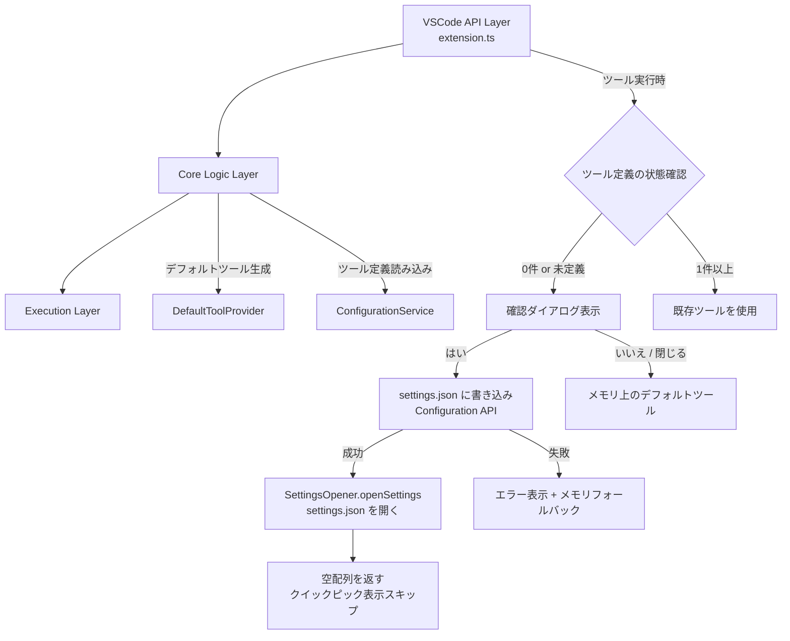
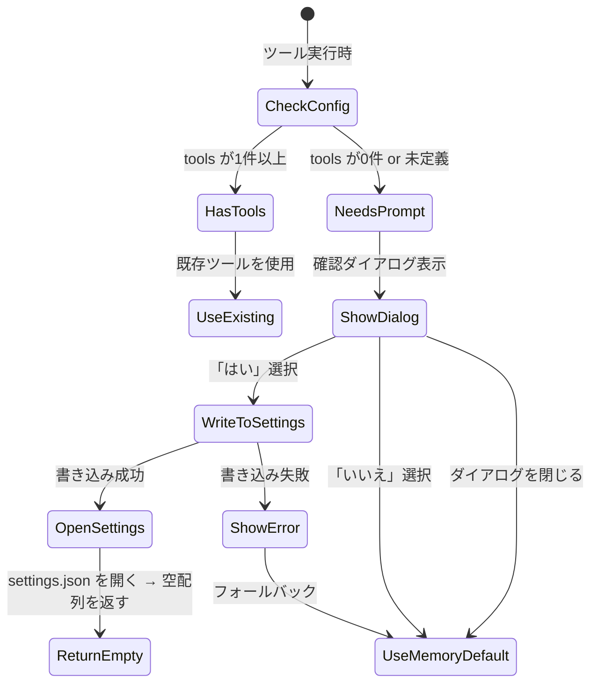

# 設計ドキュメント: デフォルトツールの settings.json 永続化

## 概要

ClickExec拡張機能において、ツール定義が0件または `clickExec.tools` 設定キーが未定義の場合に、デフォルトツール（OS標準エクスプローラーで開くコマンド）をユーザーの確認を得た上で `settings.json` に書き込む機能を追加する。

現在の動作では、デフォルトツールはメモリ上でのみ保持され、ユーザーが設定をカスタマイズする起点がない。本機能により、ユーザーの明示的な同意のもとでデフォルトツールを `settings.json` に永続化し、設定のカスタマイズ性と初回利用時の透明性を向上させる。

主要な機能フロー:
1. `activate` 時またはツール実行時に `clickExec.tools` の状態を確認
2. ツール定義が0件/未定義の場合、確認ダイアログを表示
3. ユーザーが「はい」を選択 → `settings.json` に書き込み → `openSettings()` で settings.json を開く → 空配列を返してクイックピック表示をスキップ
4. ユーザーが「いいえ」またはダイアログを閉じた → メモリ上のデフォルトツールをフォールバック
5. 書き込み失敗 → エラー表示 + メモリ上のデフォルトツールをフォールバック

## アーキテクチャ

既存の3層アーキテクチャを維持し、`DefaultToolProvider` モジュールに永続化ロジックを追加する。確認ダイアログの表示と `settings.json` への書き込みはVSCode APIに依存するため、VSCode API Layer（`extension.ts`）で呼び出す。永続化判定ロジック（書き込みが必要かどうかの判定）は純粋関数として `DefaultToolProvider` に追加し、テスタビリティを確保する。



### 設計判断

1. **永続化判定の純粋関数化**: 「書き込みが必要かどうか」の判定ロジック（`shouldPromptForPersistence`）を `DefaultToolProvider` に純粋関数として追加する。VSCode APIの `WorkspaceConfiguration.inspect()` から取得した情報を引数として受け取り、テスタビリティを確保する。
2. **確認ダイアログの実装**: `vscode.window.showInformationMessage` の選択肢付きダイアログを使用する。「はい」「いいえ」の2つの選択肢を提供し、Escキーやダイアログ外クリックで閉じた場合は `undefined` が返るため「いいえ」と同じ扱いにする。
3. **書き込み先**: `ConfigurationTarget.Global`（ユーザーグローバル設定）に書き込む。ワークスペース設定ではなくグローバル設定にすることで、すべてのワークスペースでデフォルトツールが利用可能になる。
4. **冪等性の確保**: `clickExec.tools` の設定キーが存在し、かつ配列の要素数が1件以上であれば、確認ダイアログの表示も書き込みも行わない。`inspect()` APIを使用して、設定キーの存在有無（`globalValue` が `undefined` かどうか）を正確に判定する。
5. **書き込みタイミング**: ツール実行時（`selectAndRunTool` 呼び出し時）に判定・確認を行う。`activate` 時ではなく実行時にすることで、ユーザーが機能を使おうとしたタイミングで自然に確認できる。

## コンポーネントとインターフェース

### 1. DefaultToolProvider（変更）

既存の純粋関数に加え、永続化判定ロジックを追加する。

```typescript
// --- 既存（変更なし） ---
type OsPlatform = 'win32' | 'darwin' | 'linux' | string;
function getDefaultTool(platform: OsPlatform): ToolDefinition;
function getToolsWithDefault(userTools: ToolDefinition[], platform: OsPlatform): ToolDefinition[];

// --- 新規追加 ---

/** settings.json の clickExec.tools 設定の検査結果 */
interface ToolsConfigInspection {
  /** グローバル設定に値が存在するか（undefined = 未定義） */
  globalValue: ToolDefinition[] | undefined;
}

/**
 * デフォルトツールの永続化確認が必要かどうかを判定する純粋関数。
 * globalValue が undefined（設定キー未定義）または空配列の場合に true を返す。
 */
function shouldPromptForPersistence(inspection: ToolsConfigInspection): boolean;
```

### 2. DefaultToolPersistenceService（新規）

VSCode APIに依存する永続化ロジックを担当するサービス。`extension.ts` から呼び出される。

```typescript
/**
 * デフォルトツールの永続化を管理するサービス。
 * 確認ダイアログの表示、settings.json への書き込み、
 * 書き込み成功後の settings.json オープンを担当する。
 */
class DefaultToolPersistenceService {
  private readonly openSettingsFn: () => Promise<void>;

  /**
   * @param openSettingsFn - settings.json を開く関数（デフォルト: settingsOpener.openSettings）
   */
  constructor(openSettingsFn?: () => Promise<void>);

  /**
   * デフォルトツールの永続化を試みる。
   * 1. clickExec.tools の状態を inspect() で確認
   * 2. 永続化が必要な場合、確認ダイアログを表示
   * 3. ユーザーが「はい」を選択した場合、settings.json に書き込み
   * 4. 書き込み成功後: openSettingsFn() を呼び出して settings.json を開き、空配列を返す
   *
   * @returns 使用すべきツール定義の配列（書き込み成功時は空配列）
   */
  async resolveTools(platform: OsPlatform): Promise<ToolDefinition[]>;
}
```

変更前後の `resolveTools` の返り値:

| シナリオ | 返り値 |
|---|---|
| 「はい」→ 書き込み成功 | `[]`（空配列）— settings.json を開いた後、クイックピック表示をスキップ |
| 「はい」→ 書き込み失敗 | メモリフォールバック（`getToolsWithDefault` の結果） |
| 「いいえ」/ 閉じる | メモリフォールバック（`getToolsWithDefault` の結果） |
| 永続化不要（既存ツールあり） | `globalValue`（既存のツール定義配列） |

このサービスはVSCode APIに直接依存するため、ユニットテストではモックを使用する。コンストラクタインジェクションにより `openSettingsFn` をモック関数に差し替えてテスト可能。コアの判定ロジック（`shouldPromptForPersistence`）は純粋関数としてテスト可能。

### 3. extension.ts（変更）

`selectAndRunTool` 関数内で `DefaultToolPersistenceService` を使用するように変更する。

```typescript
async function selectAndRunTool(
  tools: ToolDefinition[],
  context: PlaceholderContext,
  commandBuilder: CommandBuilder,
  terminal: TerminalManager,
  persistenceService: DefaultToolPersistenceService  // 新規追加
): Promise<void> {
  // ツール定義が0件の場合、永続化サービスを通じてツールを解決
  const effectiveTools = tools.length === 0
    ? await persistenceService.resolveTools(process.platform)
    : tools;

  // 空配列の場合は早期リターン（settings.json オープン後など）
  if (effectiveTools.length === 0) {
    return;
  }

  // 以降は既存のクイックピック表示・コマンド実行ロジック
  // ...
}
```

### 4. ConfigurationService（変更なし）

既存の `loadTools()` と `onDidChangeTools()` はそのまま使用する。`inspect()` の呼び出しは `DefaultToolPersistenceService` 内で直接行う。

## データモデル

### 確認ダイアログの選択肢

```typescript
const DIALOG_OPTIONS = {
  message: 'ClickExec: サンプルコマンドを追加しますか？',
  yes: 'はい',
  no: 'いいえ',
} as const;
```

### settings.json への書き込み内容

書き込み時は `WorkspaceConfiguration.update()` を使用し、`ConfigurationTarget.Global` に書き込む。

```typescript
// 書き込む値の例（Windows の場合）
const toolsToWrite: ToolDefinition[] = [
  {
    name: "エクスプローラーで開く",
    command: "explorer ${dir}"
  }
];

// 書き込み方法
const config = vscode.workspace.getConfiguration('clickExec');
await config.update('tools', toolsToWrite, vscode.ConfigurationTarget.Global);
```

### ToolsConfigInspection の取得方法

```typescript
const config = vscode.workspace.getConfiguration('clickExec');
const inspected = config.inspect<ToolDefinition[]>('tools');
const inspection: ToolsConfigInspection = {
  globalValue: inspected?.globalValue,
};
```

### 状態遷移




## 正確性プロパティ

*プロパティとは、システムのすべての有効な実行において真であるべき特性や振る舞いのことである。人間が読める仕様と、機械で検証可能な正確性保証の橋渡しとなる。*

### Property 1: 永続化判定の正確性

*任意の* `ToolsConfigInspection` に対して、`shouldPromptForPersistence` は `globalValue` が `undefined` または空配列（要素数0）の場合にのみ `true` を返し、`globalValue` が1件以上の要素を持つ配列の場合は `false` を返すこと。

preworkの分析:
- 要件1.1（0件/未定義でダイアログ表示）、2.1（1件以上で表示しない）、2.2（再アクティベート時の冪等性）、2.3（判定条件の仕様）はすべて同一の判定ロジックに帰着する。
- `globalValue` が `undefined`（設定キー未定義）の場合と空配列の場合を区別せず、どちらも「永続化が必要」と判定する。
- 冪等性（2.2）は、書き込み後に `globalValue` が非空になることで自動的に `false` を返すため、このプロパティに包含される。

**Validates: Requirements 1.1, 2.1, 2.2, 2.3**

### Property 2: 書き込み内容と getDefaultTool の一致性

*任意の* OSプラットフォーム文字列に対して、`settings.json` に書き込まれるデフォルトツール定義は `getDefaultTool(platform)` の返り値と完全に一致すること。すなわち、永続化される内容とメモリ上のフォールバックで使用される内容が同一であること。

preworkの分析:
- 要件1.2（「はい」で書き込み）と要件3.1〜3.5（OS別コマンド）を組み合わせると、書き込まれる内容が `getDefaultTool` の出力と一致することが重要。
- これにより、「はい」を選んで永続化した場合と「いいえ」を選んでメモリフォールバックした場合で、ユーザーが得るツール定義が同一であることを保証する。

**Validates: Requirements 1.2, 3.1, 3.2, 3.3, 3.4, 3.5**

## エラーハンドリング

### エラー分類と対応

| エラー状況 | 対応 | ユーザーへの通知 | settings.json を開くか |
|---|---|---|---|
| `settings.json` への書き込み失敗 | メモリ上のデフォルトツールをフォールバック | `vscode.window.showErrorMessage` | 開かない |
| `openSettings()` の実行失敗 | エラーを無視（書き込み自体は成功） | `openSettings` 内部でエラー表示 | 試行したが失敗 |
| 確認ダイアログがEscで閉じられた | 「いいえ」と同じ動作（メモリフォールバック） | なし | 開かない |
| `inspect()` が `undefined` を返した | 永続化が必要と判定 | なし（正常フロー） | — |

### エラーメッセージ

- 書き込み失敗: `"ClickExec: デフォルトツールの設定への書き込みに失敗しました"`
- settings.json オープン失敗: `"ClickExec: settings.json を開けませんでした"`（SettingsOpener 内部）

## テスト戦略

### テストフレームワーク

- **ユニットテスト**: Mocha + Chai（VSCode拡張機能の標準）
- **プロパティベーステスト**: [fast-check](https://github.com/dubzzz/fast-check)

### テスト対象の分類

#### プロパティベーステスト（fast-check）

純粋関数として実装される判定ロジックに対して、各正確性プロパティを実装する:

1. **永続化判定の正確性** — Property 1
   - ランダムな `ToolsConfigInspection`（`globalValue` が `undefined`、空配列、1件以上の配列）を生成し、`shouldPromptForPersistence` の返り値が仕様通りであることを検証
   - タグ: `Feature: default-tool-persistence, Property 1: 永続化判定の正確性`
   - 最低100回のイテレーション
   - 各プロパティは単一のプロパティベーステストとして実装する

2. **書き込み内容と getDefaultTool の一致性** — Property 2
   - ランダムなOSプラットフォーム文字列を生成し、永続化サービスが書き込む内容が `getDefaultTool` の出力と一致することを検証
   - タグ: `Feature: default-tool-persistence, Property 2: 書き込み内容と getDefaultTool の一致性`
   - 最低100回のイテレーション
   - 各プロパティは単一のプロパティベーステストとして実装する

#### ユニットテスト（Mocha + Chai）

- **DefaultToolPersistenceService**: VSCode APIのモックを使用し、以下を検証:
  - 「はい」選択時に `config.update()` が `ConfigurationTarget.Global` で呼ばれること（Requirements 1.2, 1.3）
  - 書き込み成功後に `openSettingsFn()` が呼ばれ、settings.json が開かれること（Requirements 1.4）
  - 書き込み成功後の返り値が空配列であること（Requirements 1.4）
  - 「いいえ」選択時に書き込みが行われず、`openSettingsFn()` が呼ばれず、メモリデフォルトが返されること（Requirements 1.5）
  - ダイアログ閉じ（undefined）時に「いいえ」と同じ動作をすること（Requirements 1.6）
  - 書き込み失敗時にエラーメッセージが表示され、`openSettingsFn()` が呼ばれず、メモリデフォルトが返されること（Requirements 1.7）

- **shouldPromptForPersistence**: 具体的なエッジケースの検証:
  - `globalValue` が `undefined` → `true`
  - `globalValue` が `[]` → `true`
  - `globalValue` が `[{name: "test", command: "test"}]` → `false`

### テストファイル構成

```
src/test/
├── unit/
│   ├── defaultToolProvider.test.ts        # 既存 + shouldPromptForPersistence のユニットテスト
│   └── defaultToolPersistenceService.test.ts  # 新規: VSCode APIモックを使った統合テスト
├── property/
│   └── defaultToolProvider.property.test.ts   # 既存 + Property 1, 2 のプロパティテスト
```

### プロパティベーステストライブラリ

- **fast-check** を使用（既存プロジェクトで採用済み）
- 各テストは最低100回のイテレーションで実行
- 各テストにはデザインドキュメントのプロパティ番号を参照するタグコメントを付与
- タグ形式: `Feature: default-tool-persistence, Property {number}: {property_text}`
