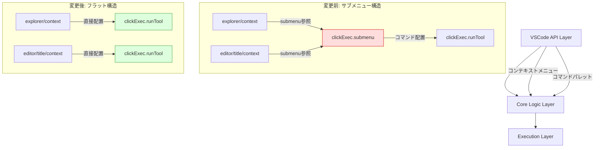

# 設計ドキュメント: コンテキストメニューのフラット化

## 概要

ClickExec拡張機能のコンテキストメニュー構造をフラット化する。現在、ツール実行コマンド（`clickExec.runTool`）は「ClickExecで実行」サブメニューの中に配置されているが、このサブメニューを廃止し、コマンドをコンテキストメニューの一階層目に直接表示するように変更する。

これにより、ユーザーは右クリック → サブメニューホバー → コマンド選択の3ステップから、右クリック → コマンド選択の2ステップでツールを実行できるようになる。

主要な変更:
1. `package.json` の `submenus` セクションを削除
2. `package.json` の `menus.clickExec.submenu` セクションを削除
3. `menus.explorer/context` と `menus.editor/title/context` で `clickExec.runTool` コマンドを直接配置
4. 既存スペックドキュメントを更新して整合性を維持

## アーキテクチャ

既存の3層アーキテクチャに変更はない。変更対象は `package.json` のメニュー定義のみであり、TypeScriptコードの変更は不要。



### 変更の影響範囲

| ファイル | 変更内容 |
|---|---|
| `package.json` | `submenus` セクション削除、`menus.clickExec.submenu` 削除、`explorer/context` と `editor/title/context` を直接コマンド参照に変更 |
| `src/extension.ts` | 変更なし |
| その他の TypeScript ファイル | 変更なし |

### 設計判断

1. **TypeScriptコードの変更不要**: コンテキストメニューの構造は `package.json` の `contributes.menus` で宣言的に定義される。サブメニューからフラットメニューへの変更は `package.json` のみで完結し、コマンドハンドラ（`extension.ts`）のロジックには影響しない。VSCodeはメニュー定義に基づいてコマンドIDとURIを自動的にハンドラに渡すため、コマンド引数の受け渡しも変更不要。
2. **グループ名の維持**: `clickExec` グループ名を維持することで、メニュー内での表示位置の一貫性を保つ。VSCodeはグループ名でメニュー項目をグルーピングし、他の拡張機能のメニュー項目と区切り線で分離する。
3. **既存スペックの更新**: サブメニュー構造に言及している既存スペックドキュメントを更新し、ドキュメント間の整合性を保つ。

## コンポーネントとインターフェース

### 1. package.json（変更）

`contributes` セクションのメニュー定義を変更する。

**変更前:**
```json
{
  "menus": {
    "explorer/context": [
      {
        "submenu": "clickExec.submenu",
        "group": "clickExec"
      }
    ],
    "editor/title/context": [
      {
        "submenu": "clickExec.submenu",
        "group": "clickExec"
      }
    ],
    "clickExec.submenu": [
      {
        "command": "clickExec.runTool",
        "group": "tools"
      }
    ]
  },
  "submenus": [
    {
      "id": "clickExec.submenu",
      "label": "ClickExecで実行"
    }
  ]
}
```

**変更後:**
```json
{
  "menus": {
    "explorer/context": [
      {
        "command": "clickExec.runTool",
        "group": "clickExec"
      }
    ],
    "editor/title/context": [
      {
        "command": "clickExec.runTool",
        "group": "clickExec"
      }
    ]
  }
}
```

変更点:
- `contributes.submenus` セクションを完全に削除
- `contributes.menus.clickExec.submenu` セクションを完全に削除
- `contributes.menus.explorer/context` のエントリを `submenu` 参照から `command` 直接参照に変更
- `contributes.menus.editor/title/context` のエントリを `submenu` 参照から `command` 直接参照に変更
- `clickExec` グループ名は維持

### 2. extension.ts（変更なし）

コマンドハンドラのロジックに変更はない。`clickExec.runTool` コマンドは引き続き `uri: vscode.Uri` 引数を受け取り、ツール選択ダイアログを表示する。VSCodeのメニューシステムがコンテキスト（ファイル/フォルダのURI）をコマンドハンドラに自動的に渡す仕組みは、サブメニュー経由でもフラットメニューでも同一である。

### 3. 既存スペックの更新

#### 3.1 open-settings-json スペック

- `design.md`: package.json の contributes 定義からサブメニュー関連の記述を更新（フラット構造に変更）

#### 3.2 remove-open-settings-menu スペック

- `design.md`: package.json の最終状態をフラット構造に更新

#### 3.3 vscode-external-tools スペック

- `design.md`: メニュー構成の記述をフラット構造に更新

## データモデル

データモデルへの変更はない。`ToolDefinition`、`PlaceholderContext`、`ExecutionCommand` 等の型定義は変更不要。

### package.json の contributes 最終状態

```json
{
  "contributes": {
    "configuration": {
      "title": "ClickExec",
      "properties": {
        "clickExec.tools": {
          "type": "array",
          "default": [],
          "description": "外部ツールの定義一覧",
          "items": { "..." : "（既存のまま）" }
        }
      }
    },
    "commands": [
      { "command": "clickExec.runTool", "title": "ClickExec: ツールを実行" },
      { "command": "clickExec.selectAndRunTool", "title": "ClickExec: ツールを選択して実行" }
    ],
    "menus": {
      "explorer/context": [
        { "command": "clickExec.runTool", "group": "clickExec" }
      ],
      "editor/title/context": [
        { "command": "clickExec.runTool", "group": "clickExec" }
      ]
    }
  }
}
```

注: `submenus` セクションと `menus.clickExec.submenu` セクションは完全に削除される。

## エラーハンドリング

この機能変更ではエラーハンドリングの追加・変更はない。

既存のエラーハンドリングは変更なし:
- `clickExec.runTool` コマンドハンドラ内の `try/catch` によるエラーメッセージ表示は維持
- `selectAndRunTool` 関数内のツール定義0件時のフォールバック動作は維持

## テスト戦略

### PBT適用性の評価

この機能は `package.json` の宣言的な設定変更のみであり、新しいロジックの追加はない。以下の理由からプロパティベーステスト（PBT）は適用しない:

- **純粋関数の追加なし**: 新しいTypeScriptコードの追加がなく、テスト対象となる関数が存在しない
- **入力空間なし**: `package.json` の構造は固定であり、入力のバリエーションが存在しない
- **宣言的設定の変更**: メニュー構造の変更は `package.json` の静的な定義であり、ランタイムの動作ではない

### テストフレームワーク

- **ユニットテスト**: Mocha + Chai

### テスト方針

#### ユニットテスト（新規）

1. **package.json 構造検証テスト — サブメニュー定義の不在**
   - `contributes.submenus` セクションが存在しないことを検証
   - `contributes.menus` に `clickExec.submenu` キーが存在しないことを検証
   - 検証対象: 要件1.1, 1.2, 1.3

2. **package.json 構造検証テスト — コマンドの直接配置**
   - `contributes.menus.explorer/context` に `clickExec.runTool` コマンドが直接配置されていることを検証
   - `contributes.menus.editor/title/context` に `clickExec.runTool` コマンドが直接配置されていることを検証
   - 各エントリが `clickExec` グループに属していることを検証
   - 検証対象: 要件2.1, 2.2, 2.3

#### 既存テストの実行確認（回帰テスト）

以下の既存テストが引き続きパスすることを確認する:

1. **defaultToolPersistenceService.property.test.ts** — DefaultToolPersistenceService の動作保持
2. **defaultToolProvider.property.test.ts** — DefaultToolProvider の動作保持
3. **commandBuilder.property.test.ts** — CommandBuilder の動作保持
4. **placeholderResolver.property.test.ts** — PlaceholderResolver の動作保持
5. **configurationService.property.test.ts** — ConfigurationService の動作保持

### テストファイル構成

```
src/test/
├── unit/
│   └── flattenContextMenu.test.ts  # 新規: package.json 構造検証
├── property/
│   ├── commandBuilder.property.test.ts                # 既存: 回帰テスト
│   ├── configurationService.property.test.ts          # 既存: 回帰テスト
│   ├── defaultToolPersistenceService.property.test.ts # 既存: 回帰テスト
│   ├── defaultToolProvider.property.test.ts           # 既存: 回帰テスト
│   └── placeholderResolver.property.test.ts           # 既存: 回帰テスト
```
