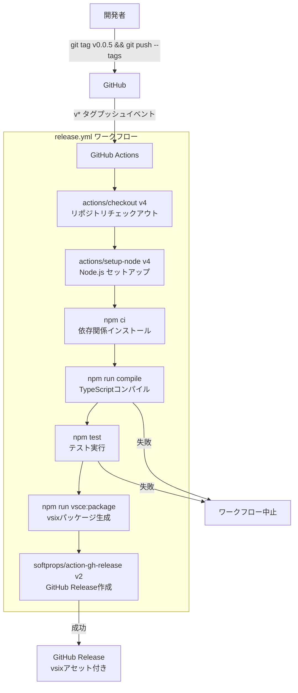
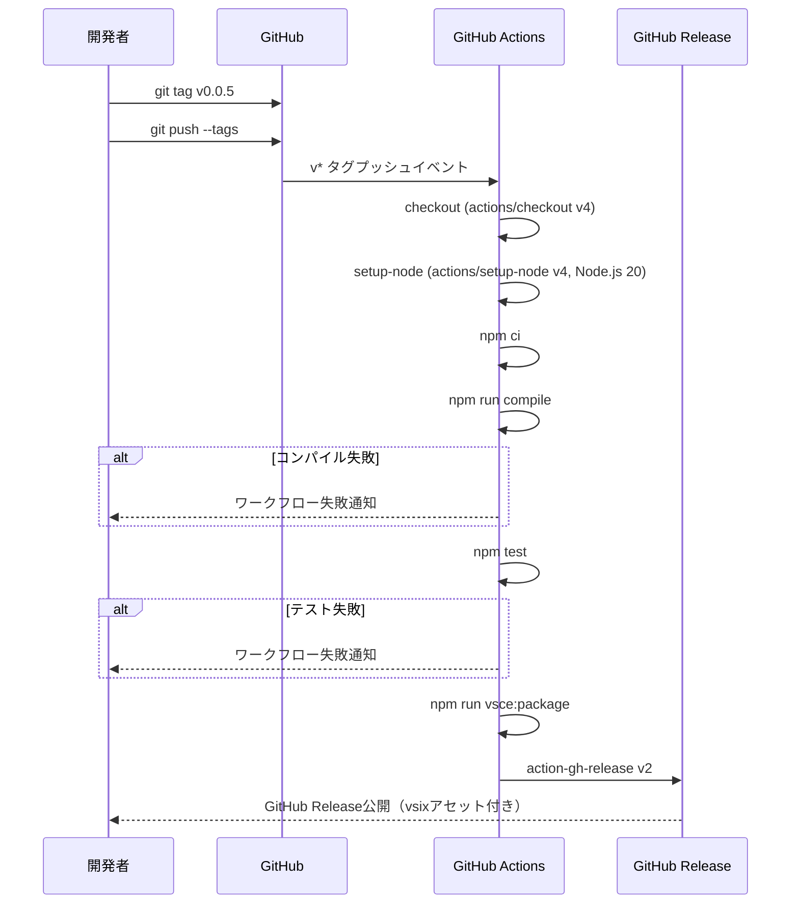

# 設計ドキュメント: GitHub Actionsリリースワークフロー

## 概要

ClickExec拡張機能のリリースプロセスをGitHub Actionsで自動化する。`v*` パターンのGitタグプッシュをトリガーに、TypeScriptコンパイル → テスト実行 → vsixパッケージ生成 → GitHub Release作成の一連のパイプラインを自動実行する。

現在の状態では、vsixパッケージの生成とリリースは手動で行われており、リポジトリルートに過去のvsixファイル（`clickexec-0.0.1.vsix` ～ `clickexec-0.0.4.vsix`）が残っている。本機能により以下を実現する:

1. `@vscode/vsce` を devDependencies に追加し、`npm run vsce:package` でvsixパッケージを生成可能にする
2. `.github/workflows/release.yml` にリリースワークフローを定義する
3. `softprops/action-gh-release` を使用してGitHub Releaseを自動作成し、vsixファイルをアセットとして添付する
4. リポジトリルートの既存vsixファイルを削除してクリーンアップする

## アーキテクチャ

本機能はCI/CDパイプラインの構築であり、既存のアプリケーションアーキテクチャ（3層構造）には影響しない。変更対象はプロジェクト設定ファイルとCI/CD設定ファイルのみ。



### 設計判断

1. **`@vscode/vsce` の devDependencies 追加**: CI環境でグローバルインストールに依存せず、`npm ci` で確実にインストールされるようにする。ローカル開発でも `npm run vsce:package` で同じ方法でパッケージを生成できる。
2. **`softprops/action-gh-release@v2` の採用**: GitHub公式の `actions/create-release` は非推奨（archived）のため、コミュニティで広く使われている `softprops/action-gh-release` を使用する。メジャーバージョンタグ（`@v2`）で固定し、破壊的変更を防ぐ。
3. **`GITHUB_TOKEN` の使用**: GitHub Actionsが自動的に提供する `GITHUB_TOKEN` を使用する。追加のシークレット設定が不要で、`contents: write` 権限のみを明示的に付与することで最小権限の原則を守る。
4. **ビルド・テスト失敗時の中止**: GitHub Actionsのステップは順次実行されるため、`npm run compile` や `npm test` が非ゼロ終了コードを返した場合、後続のステップ（vsixパッケージ生成、リリース作成）は自動的にスキップされる。
5. **リリースノートの自動生成**: `generate_release_notes: true` オプションにより、前回のリリースからのコミット履歴に基づいてリリースノートを自動生成する。手動でのリリースノート作成を不要にする。
6. **既存vsixファイルの削除**: リポジトリルートの `clickexec-0.0.*.vsix` ファイルは、自動リリースへの移行に伴い不要となるため、移行タスクとして削除する。`.gitignore` に `*.vsix` が既に含まれているため、今後vsixファイルがコミットされることはない。

## コンポーネントとインターフェース

### 1. package.json（変更）

`@vscode/vsce` を devDependencies に追加し、`vsce:package` スクリプトを定義する。

```json
{
  "scripts": {
    "compile": "tsc -p ./",
    "watch": "tsc -watch -p ./",
    "pretest": "npm run compile",
    "test": "mocha --require ./test-setup.js ./out/test/**/*.test.js --timeout 10000",
    "test:property": "mocha --require ./test-setup.js ./out/test/property/**/*.property.test.js --timeout 30000",
    "vsce:package": "vsce package"
  },
  "devDependencies": {
    "@vscode/vsce": "^3.0.0"
  }
}
```

`vsce package` コマンドは、`package.json` の `name` と `version` フィールドを参照して `clickexec-{version}.vsix` ファイルをカレントディレクトリに生成する。

### 2. .github/workflows/release.yml（新規）

リリースワークフローの定義ファイル。

```yaml
name: Release

on:
  push:
    tags:
      - 'v*'

permissions:
  contents: write

jobs:
  release:
    runs-on: ubuntu-latest
    steps:
      - name: Checkout repository
        uses: actions/checkout@v4

      - name: Setup Node.js
        uses: actions/setup-node@v4
        with:
          node-version: '20'
          cache: 'npm'

      - name: Install dependencies
        run: npm ci

      - name: Compile TypeScript
        run: npm run compile

      - name: Run tests
        run: npm test

      - name: Build VSIX package
        run: npm run vsce:package

      - name: Create GitHub Release
        uses: softprops/action-gh-release@v2
        with:
          files: '*.vsix'
          generate_release_notes: true
          draft: false
        env:
          GITHUB_TOKEN: ${{ secrets.GITHUB_TOKEN }}
```

### 3. .vscodeignore（変更なし）

現在の `.vscodeignore` には既に `*.vsix` パターンが含まれているため、変更不要。

```
.kiro/**
.vscode/**
.git/**
.gitignore
src/**
node_modules/**
out/test/**
test-setup.js
tsconfig.json
*.vsix
package-lock.json
```

### 4. .gitignore（変更なし）

現在の `.gitignore` には既に `*.vsix` パターンが含まれているため、変更不要。

```
node_modules/
dist/
*.js
*.d.ts
*.js.map
*.vsix
```

### 5. 既存vsixファイル（削除）

リポジトリルートに存在する以下のファイルを削除する:

- `clickexec-0.0.1.vsix`
- `clickexec-0.0.2.vsix`
- `clickexec-0.0.3.vsix`
- `clickexec-0.0.4.vsix`

## データモデル

本機能にはアプリケーションレベルのデータモデル変更はない。以下はワークフローで扱うデータの構造を示す。

### ワークフロートリガー

```yaml
# トリガー条件
on:
  push:
    tags:
      - 'v*'  # v0.0.5, v1.0.0 など
```

タグ名はセマンティックバージョニングに基づく `v{major}.{minor}.{patch}` 形式を想定する。ワークフロー内では `${{ github.ref_name }}` でタグ名を参照できる。

### GitHub Releaseの構成

| 項目 | 値 |
|---|---|
| リリースタイトル | タグ名（例: `v0.0.5`）— `softprops/action-gh-release` のデフォルト動作 |
| リリースノート | GitHubの自動生成（`generate_release_notes: true`） |
| アセット | `clickexec-{version}.vsix` ファイル |
| ドラフト | `false`（公開状態） |

### ワークフローの実行フロー



## エラーハンドリング

### ワークフロー内のエラー対応

| ステップ | 失敗時の動作 | 開発者への通知 |
|---|---|---|
| `npm ci` | ワークフロー中止 | GitHub Actions失敗通知 |
| `npm run compile` | ワークフロー中止（後続ステップスキップ） | GitHub Actions失敗通知 |
| `npm test` | ワークフロー中止（後続ステップスキップ） | GitHub Actions失敗通知 |
| `npm run vsce:package` | ワークフロー中止 | GitHub Actions失敗通知 |
| `softprops/action-gh-release` | ワークフロー失敗 | GitHub Actions失敗通知 |

GitHub Actionsのデフォルト動作として、各ステップが非ゼロ終了コードを返した場合、後続のステップは実行されない。これにより、要件2.7（コンパイルまたはテスト失敗時のリリース中止）が自動的に満たされる。

### 権限エラー

`contents: write` 権限が不足している場合、`softprops/action-gh-release` ステップで `403 Forbidden` エラーが発生する。この場合、リポジトリの Settings → Actions → General → Workflow permissions で「Read and write permissions」が有効になっていることを確認する必要がある。

### vsixパッケージ生成エラー

`vsce package` は以下の場合にエラーを返す:
- `package.json` に必須フィールド（`name`, `version`, `publisher`, `engines.vscode`）が不足している場合
- `README.md` が存在しない場合
- `.vscodeignore` で除外されるべきファイルに問題がある場合

これらはローカル開発時に `npm run vsce:package` を実行して事前に検出できる。

## テスト戦略

### PBTの適用判断

本機能はCI/CDパイプラインの構築（GitHub Actions YAMLファイルの作成、npm scriptの追加、ファイル削除）であり、以下の理由からプロパティベーステスト（PBT）は**適用しない**:

- **宣言的な設定ファイル**: GitHub Actions YAMLは宣言的な設定であり、入力に対して出力が変化する関数ではない
- **外部サービスへの依存**: ワークフローの実行はGitHub Actionsインフラに依存し、ローカルでの反復テストは不可能
- **純粋関数の不在**: 本機能にはテスト対象となる純粋関数やビジネスロジックが存在しない
- **入力空間の固定**: ワークフローの設定値は固定であり、ランダム入力による検証は意味をなさない

### テスト方針

本機能のテストは以下の方法で行う:

#### 1. ローカル検証（手動）

- `npm run vsce:package` を実行し、`clickexec-{version}.vsix` が正しく生成されることを確認
- 生成されたvsixファイルのサイズと内容（不要ファイルが含まれていないこと）を確認
- `.vscodeignore` の設定が正しく機能していることを確認

#### 2. ワークフロー構文検証

- GitHub Actionsのワークフロー構文は、リポジトリにプッシュした時点でGitHubが自動的に検証する
- 構文エラーがある場合、Actionsタブにエラーが表示される

#### 3. 統合テスト（実際のタグプッシュ）

- テスト用のタグ（例: `v0.0.5`）をプッシュし、ワークフローが正常に実行されることを確認
- GitHub Releaseが作成され、vsixファイルがアセットとして添付されていることを確認
- リリースノートが自動生成されていることを確認

#### 4. 既存テストの維持

- `npm test` が引き続き成功することを確認（既存のユニットテスト・プロパティテストに影響がないこと）
- `@vscode/vsce` の追加が既存の依存関係と競合しないことを確認
