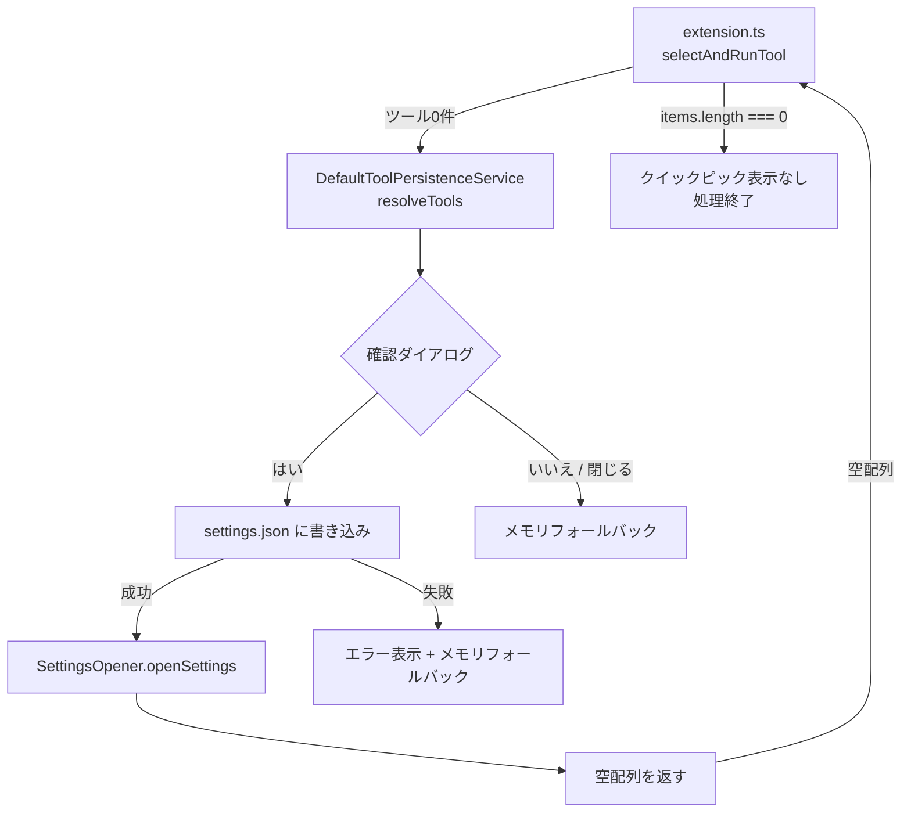

# 設計ドキュメント: サンプルコマンド書き込み後の settings.json 自動オープン

## 概要

ClickExec拡張機能において、`DefaultToolPersistenceService` がサンプルコマンドを `settings.json` に正常に書き込んだ後、自動的に `settings.json` を開いて `clickExec.tools` セクションにカーソルを移動する機能を追加する。

現在の動作では、書き込み成功後にそのままツール選択クイックピックに進むが、ユーザーが書き込まれた内容を確認・カスタマイズする導線がない。本機能により、書き込み直後に設定ファイルを開くことで、ユーザーが内容を即座に確認・編集できるようにする。

主要な変更フロー:
1. `DefaultToolPersistenceService.resolveTools()` で確認ダイアログ → 書き込み成功
2. 既存の `SettingsOpener.openSettings()` を呼び出して `settings.json` を開く
3. 空配列を返すことで、呼び出し元のクイックピック表示をスキップさせる

書き込みが失敗した場合、ユーザーが「いいえ」を選択した場合、ダイアログを閉じた場合は `settings.json` を開かず、従来通りの動作を維持する。

## アーキテクチャ

既存の3層アーキテクチャを維持し、`DefaultToolPersistenceService` に最小限の変更を加える。



### 設計判断

1. **変更箇所の最小化**: `DefaultToolPersistenceService.resolveTools()` 内の書き込み成功パスにのみ変更を加える。`openSettings()` 呼び出しと空配列返却の2行の追加で実現する。
2. **空配列による制御**: 書き込み成功後に空配列 `[]` を返すことで、呼び出し元の `selectAndRunTool` がクイックピックの `items` を0件と判断し、`showQuickPick` に空リストが渡される。ユーザーは何も選択できないため、実質的にツール実行がスキップされる。ただし、より明確な制御のために `selectAndRunTool` 側で `effectiveTools.length === 0` のガード条件を追加し、空配列の場合は早期リターンする。
3. **既存 SettingsOpener の再利用**: `openSettings()` は既に `settings.json` を開いて `clickExec.tools` セクションにカーソルを移動する機能を持っている。新規実装は不要。
4. **SettingsOpener の依存注入**: テスタビリティのため、`DefaultToolPersistenceService` のコンストラクタに `openSettings` 関数を注入する方式を採用する。これにより、ユニットテストでモック関数を渡せる。

## コンポーネントとインターフェース

### 1. DefaultToolPersistenceService（変更）

書き込み成功後に `openSettings()` を呼び出し、空配列を返すように変更する。

```typescript
/**
 * デフォルトツールの永続化を管理するサービス。
 * 確認ダイアログの表示、settings.json への書き込み、
 * 書き込み成功後の settings.json オープンを担当する。
 */
class DefaultToolPersistenceService {
  private readonly openSettingsFn: () => Promise<void>;

  /**
   * @param openSettingsFn - settings.json を開く関数（デフォルト: settingsOpener.openSettings）
   */
  constructor(openSettingsFn?: () => Promise<void>);

  /**
   * デフォルトツールの永続化を試みる。
   * 書き込み成功時: openSettings() を呼び出し、空配列を返す
   * 書き込み失敗時: エラー表示 + メモリフォールバック
   * 「いいえ」/閉じる: メモリフォールバック
   *
   * @returns 使用すべきツール定義の配列（書き込み成功時は空配列）
   */
  async resolveTools(platform: OsPlatform): Promise<ToolDefinition[]>;
}
```

変更前後の `resolveTools` の返り値:

| シナリオ | 変更前 | 変更後 |
|---|---|---|
| 「はい」→ 書き込み成功 | `defaultTools`（1件） | `[]`（空配列） |
| 「はい」→ 書き込み失敗 | メモリフォールバック | メモリフォールバック（変更なし） |
| 「いいえ」/ 閉じる | メモリフォールバック | メモリフォールバック（変更なし） |
| 永続化不要（既存ツールあり） | `globalValue` | `globalValue`（変更なし） |

### 2. extension.ts（変更）

`selectAndRunTool` に空配列ガードを追加する。

```typescript
async function selectAndRunTool(
  tools: ToolDefinition[],
  context: PlaceholderContext,
  commandBuilder: CommandBuilder,
  terminal: TerminalManager,
  persistenceService: DefaultToolPersistenceService
): Promise<void> {
  const effectiveTools = tools.length === 0
    ? await persistenceService.resolveTools(process.platform)
    : tools;

  // 空配列の場合は早期リターン（settings.json オープン後など）
  if (effectiveTools.length === 0) {
    return;
  }

  // 以降は既存のクイックピック表示・コマンド実行ロジック
  // ...
}
```

### 3. SettingsOpener（変更なし）

既存の `openSettings()` をそのまま使用する。変更は不要。

### 4. DefaultToolProvider（変更なし）

純粋関数群は変更なし。

## データモデル

### resolveTools の返り値の意味

`resolveTools` の返り値は、呼び出し元が使用すべきツール定義の配列である。本機能追加により、返り値に新しい意味が加わる:

| 返り値 | 意味 |
|---|---|
| 1件以上の配列 | ツール選択クイックピックを表示する |
| 空配列 `[]` | ツール実行をスキップする（settings.json が開かれた後など） |

### DefaultToolPersistenceService のコンストラクタ引数

```typescript
// extension.ts での初期化
import { openSettings } from './settingsOpener';

const persistenceService = new DefaultToolPersistenceService(openSettings);
```


## 正確性プロパティ

*プロパティとは、システムのすべての有効な実行において真であるべき特性や振る舞いのことである。人間が読める仕様と、機械で検証可能な正確性保証の橋渡しとなる。*

### Property 1: 書き込み成功時の空配列返却

*任意の* OSプラットフォーム文字列に対して、確認ダイアログで「はい」が選択され、`settings.json` への書き込みが成功した場合、`resolveTools()` は空配列 `[]` を返すこと。

preworkの分析:
- 要件2.2（空配列を返す）が直接的な仕様。要件1.1（settings.json を開く）の副作用として、呼び出し元にツール実行をスキップさせるために空配列を返す。
- 任意のプラットフォームで成り立つべき普遍的なルールである。

**Validates: Requirements 1.1, 2.2**

### Property 2: 非確認時の非空配列返却と openSettings 非呼び出し

*任意の* OSプラットフォーム文字列に対して、確認ダイアログで「いいえ」が選択された場合、またはダイアログが閉じられた場合（`undefined`）、`resolveTools()` は1件以上の要素を持つ配列を返し、`openSettings()` は呼び出されないこと。

preworkの分析:
- 要件1.3（「いいえ」で開かない）と要件1.4（閉じた場合に開かない）は同一の判定ロジックに帰着する。「はい」以外のすべてのケースで openSettings が呼ばれず、メモリフォールバック（非空配列）が返される。
- 1.3と1.4を統合した1つのプロパティとして表現する。

**Validates: Requirements 1.3, 1.4**

### Property 3: 空配列時のクイックピック非表示

*任意の* 空のツール定義配列に対して、`selectAndRunTool` はクイックピックを表示せず、早期リターンすること。

preworkの分析:
- 要件2.1（クイックピックを表示しない）は、`selectAndRunTool` の呼び出し元の振る舞いに関するプロパティ。`effectiveTools` が空配列の場合、`showQuickPick` が呼ばれないことを保証する。
- これは `resolveTools` とは異なるコンポーネントのプロパティであり、独立して検証する価値がある。

**Validates: Requirements 2.1**

## エラーハンドリング

### エラー分類と対応

| エラー状況 | 対応 | ユーザーへの通知 | settings.json を開くか |
|---|---|---|---|
| `settings.json` への書き込み失敗 | メモリフォールバック | `vscode.window.showErrorMessage` | 開かない |
| `openSettings()` の実行失敗 | エラーを無視（書き込み自体は成功） | `openSettings` 内部でエラー表示 | 試行したが失敗 |
| 確認ダイアログがEscで閉じられた | メモリフォールバック | なし | 開かない |

### エラーメッセージ

既存のエラーメッセージをそのまま使用する:
- 書き込み失敗: `"ClickExec: デフォルトツールの設定への書き込みに失敗しました"`
- settings.json オープン失敗: `"ClickExec: settings.json を開けませんでした"`（SettingsOpener 内部）

## テスト戦略

### テストフレームワーク

- **ユニットテスト**: Mocha + Chai（VSCode拡張機能の標準）
- **プロパティベーステスト**: [fast-check](https://github.com/dubzzz/fast-check)

### テスト対象の分類

#### プロパティベーステスト（fast-check）

1. **書き込み成功時の空配列返却** — Property 1
   - ランダムなOSプラットフォーム文字列を生成し、ダイアログ「はい」+ 書き込み成功のモック環境で `resolveTools()` が空配列を返すことを検証
   - タグ: `Feature: open-settings-after-sample-add, Property 1: 書き込み成功時の空配列返却`
   - 最低100回のイテレーション
   - 各プロパティは単一のプロパティベーステストとして実装する

2. **非確認時の非空配列返却と openSettings 非呼び出し** — Property 2
   - ランダムなOSプラットフォーム文字列と非確認応答（「いいえ」または `undefined`）を生成し、`resolveTools()` が非空配列を返し、`openSettings` が呼ばれないことを検証
   - タグ: `Feature: open-settings-after-sample-add, Property 2: 非確認時の非空配列返却と openSettings 非呼び出し`
   - 最低100回のイテレーション
   - 各プロパティは単一のプロパティベーステストとして実装する

3. **空配列時のクイックピック非表示** — Property 3
   - ランダムな `PlaceholderContext` を生成し、空のツール配列で `selectAndRunTool` を呼び出した際に `showQuickPick` が呼ばれないことを検証
   - タグ: `Feature: open-settings-after-sample-add, Property 3: 空配列時のクイックピック非表示`
   - 最低100回のイテレーション
   - 各プロパティは単一のプロパティベーステストとして実装する

#### ユニットテスト（Mocha + Chai）

- **DefaultToolPersistenceService**: VSCode APIのモックを使用し、以下を検証:
  - 書き込み成功後に `openSettings()` が呼ばれること（Requirements 1.1, 1.2）
  - 書き込み失敗時に `openSettings()` が呼ばれないこと（Requirements 1.5）
  - 書き込み成功後の返り値が空配列であること（Requirements 2.2）

### テストファイル構成

```
src/test/
├── unit/
│   └── defaultToolPersistenceService.test.ts  # 既存 + openSettings 呼び出しのテスト追加
├── property/
│   └── defaultToolPersistenceService.property.test.ts  # 新規: Property 1, 2, 3
```

### プロパティベーステストライブラリ

- **fast-check** を使用（既存プロジェクトで採用済み）
- 各テストは最低100回のイテレーションで実行
- 各テストにはデザインドキュメントのプロパティ番号を参照するタグコメントを付与
- タグ形式: `Feature: open-settings-after-sample-add, Property {number}: {property_text}`
