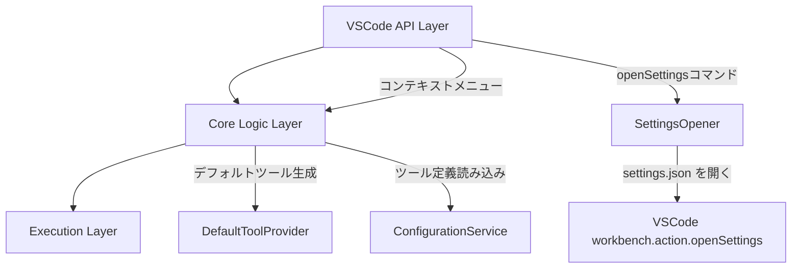

# 設計ドキュメント: settings.json を開く機能

## 概要

ClickExec拡張機能に、`settings.json` の `clickExec.tools` 設定セクションを直接開くコマンドと、コンテキストメニューからのアクセス、およびツール未設定時のデフォルトツール自動追加機能を追加する。

主要な機能フロー:
1. `clickExec.openSettings` コマンドで `settings.json` を開き、`clickExec.tools` セクションにカーソルを移動
2. コンテキストメニューの「ClickExecで実行」サブメニュー内に「設定を開く...」メニュー項目を追加
3. ツール定義が0件の場合、OS標準エクスプローラーで開くデフォルトツールをメモリ上で自動追加

## アーキテクチャ

既存の3層アーキテクチャを維持し、各レイヤーに最小限の変更を加える。



### 新規コンポーネント

- **SettingsOpener**: `settings.json` を開いて `clickExec.tools` セクションにカーソルを移動するロジック
- **DefaultToolProvider**: OS判定とデフォルトツール定義の生成を担当する純粋関数モジュール

### 設計判断

1. **settings.json を開く方法**: VSCode組み込みコマンド `workbench.action.openSettingsJson` を使用して settings.json を開き、テキスト検索で `clickExec.tools` の位置を特定してカーソルを移動する。`workbench.action.openSettings` (UI) ではなく JSON ファイルを直接開く方式を採用する。これにより、ユーザーが直接 JSON を編集できる。
2. **デフォルトツールの提供方式**: `settings.json` には書き込まず、メモリ上でのみ保持する。`ConfigurationService.loadTools()` の結果が0件の場合に `DefaultToolProvider` からデフォルトツールを取得する。これにより、ユーザーの設定ファイルを汚さない。
3. **OS判定の純粋関数化**: `process.platform` の値を引数として受け取る純粋関数として実装し、テスタビリティを確保する。
4. **メニュー項目の配置**: ~~`package.json` の `menus` 定義で `group` を使い、ツール一覧と「設定を開く...」を区切り線で分離する。ツール一覧は `group: "tools"`, 設定メニューは `group: "settings"` とする。~~ （削除済み — remove-open-settings-menu により、サブメニュー内は `tools` グループのみとなった）

## コンポーネントとインターフェース

### 1. DefaultToolProvider（新規）

OS判定に基づくデフォルトツール定義の生成を担当する純粋関数モジュール。

```typescript
/**
 * OS種別を表す型。process.platform の値のサブセット。
 */
type OsPlatform = 'win32' | 'darwin' | 'linux' | string;

/**
 * 指定されたOSプラットフォームに対応するデフォルトツール定義を返す。
 * ツール定義が0件の場合にのみ使用される。
 */
function getDefaultTool(platform: OsPlatform): ToolDefinition;
```

- Windows: `{ name: "エクスプローラーで開く", command: "explorer ${dir}" }`
- macOS: `{ name: "エクスプローラーで開く", command: "open ${dir}" }`
- Linux: `{ name: "エクスプローラーで開く", command: "xdg-open ${dir}" }`
- その他のOS: Linux と同じコマンドにフォールバック

### 2. SettingsOpener（新規）

> **note**: コマンド登録は削除済み、内部APIとしてのみ使用（remove-open-settings-menu により変更）

`settings.json` を開いて `clickExec.tools` セクションにカーソルを移動するロジック。

```typescript
/**
 * settings.json を開き、clickExec.tools セクションにカーソルを移動する。
 */
async function openSettings(): Promise<void>;
```

実装方針:
1. `vscode.commands.executeCommand('workbench.action.openSettingsJson')` で settings.json を開く
2. 開かれたドキュメント内で `"clickExec.tools"` を検索
3. 見つかった場合、その位置にカーソルを移動し、該当行を表示する
4. 見つからない場合は、ファイルの先頭を表示する（設定がまだ追加されていない場合）

### 3. ConfigurationService（変更）

既存の `loadTools()` にデフォルトツール追加ロジックを統合する。

```typescript
class ConfigurationService {
  /**
   * settings.json からツール定義を読み込み、バリデーション済みの配列を返す。
   * ツール定義が0件の場合はデフォルトツールを含む配列を返す。
   */
  loadTools(): ToolDefinition[];

  /**
   * settings.json からツール定義を読み込み、デフォルトツールを含めない配列を返す。
   * ユーザーが明示的に設定したツールのみを返す。
   */
  loadUserTools(): ToolDefinition[];
}
```

設計の選択肢として、`loadTools()` 内でデフォルトツールを追加する方式と、呼び出し元（`extension.ts`）で追加する方式を検討した。`extension.ts` 側で追加する方式を採用する。理由:
- `ConfigurationService` の責務を設定の読み込みとバリデーションに限定する
- デフォルトツールの追加は表示ロジックに近い関心事である
- テスト時にデフォルトツールの有無を制御しやすい

→ 最終的に `ConfigurationService` は変更せず、`extension.ts` 内で `DefaultToolProvider` を呼び出す。

### 4. extension.ts（変更）

> **note**: `clickExec.openSettings` コマンド登録は削除済み（remove-open-settings-menu により変更）

以下の変更を加える:

```typescript
export function activate(context: vscode.ExtensionContext): void {
  // ... 既存の初期化 ...

  // 削除済み: openSettings コマンドの登録（remove-open-settings-menu により削除）
  // const openSettingsDisposable = vscode.commands.registerCommand(
  //   'clickExec.openSettings',
  //   () => openSettings()
  // );

  // 既存の selectAndRunTool 呼び出し時にデフォルトツールを考慮
  // currentTools が0件の場合は getDefaultTool(process.platform) を追加
}
```

### 5. package.json（変更）

> **note**: `clickExec.openSettings` コマンド定義およびメニューエントリは削除済み（remove-open-settings-menu により変更）

以下の contributes 定義が現在の状態:

```json
{
  "menus": {
    "clickExec.submenu": [
      {
        "command": "clickExec.runTool",
        "group": "tools"
      }
    ]
  }
}
```

サブメニュー内は `tools` グループのみとなり、区切り線は表示されない。

## データモデル

### デフォルトツール定義

デフォルトツールは `ToolDefinition` インターフェースをそのまま使用する。settings.json には書き込まず、メモリ上でのみ保持する。

```typescript
// Windows の場合
const defaultTool: ToolDefinition = {
  name: "エクスプローラーで開く",
  command: "explorer ${dir}"
};

// macOS の場合
const defaultTool: ToolDefinition = {
  name: "エクスプローラーで開く",
  command: "open ${dir}"
};

// Linux の場合
const defaultTool: ToolDefinition = {
  name: "エクスプローラーで開く",
  command: "xdg-open ${dir}"
};
```

### OS → コマンドのマッピング

```typescript
const OS_COMMAND_MAP: Record<string, string> = {
  win32: 'explorer ${dir}',
  darwin: 'open ${dir}',
  linux: 'xdg-open ${dir}',
};
const DEFAULT_COMMAND = 'xdg-open ${dir}';
```

### package.json の contributes 変更差分

> **note**: `clickExec.openSettings` コマンド定義およびサブメニューエントリは削除済み（remove-open-settings-menu により変更）

```json
{
  "contributes": {
    "commands": [
      { "command": "clickExec.runTool", "title": "ClickExec: ツールを実行" },
      { "command": "clickExec.selectAndRunTool", "title": "ClickExec: ツールを選択して実行" }
    ],
    "menus": {
      "explorer/context": [
        { "submenu": "clickExec.submenu", "group": "clickExec" }
      ],
      "editor/title/context": [
        { "submenu": "clickExec.submenu", "group": "clickExec" }
      ],
      "clickExec.submenu": [
        { "command": "clickExec.runTool", "group": "tools" }
      ]
    },
    "submenus": [
      { "id": "clickExec.submenu", "label": "ClickExecで実行" }
    ]
  }
}
```

## 正確性プロパティ

*プロパティとは、システムのすべての有効な実行において真であるべき特性や振る舞いのことである。人間が読める仕様と、機械で検証可能な正確性保証の橋渡しとなる。*

### Property 1: デフォルトツールの条件付き追加

*任意の*ツール定義リストに対して、リストが空（0件）の場合はデフォルトツールが1件追加され、そのツールの表示名が「エクスプローラーで開く」であること。リストが1件以上の場合はデフォルトツールが追加されず、元のリストがそのまま返されること。

**Validates: Requirements 3.1, 3.2, 3.6**

### Property 2: OSプラットフォームとデフォルトコマンドの正しい対応

*任意の*サポート対象OSプラットフォーム（win32, darwin, linux）に対して、生成されるデフォルトツールのコマンドが、対応するOS標準エクスプローラーコマンド（`explorer ${dir}`, `open ${dir}`, `xdg-open ${dir}`）と一致すること。また、未知のプラットフォームに対してもエラーを発生させず、フォールバックコマンドを返すこと。

**Validates: Requirements 3.3, 3.4, 3.5**

## エラーハンドリング

### エラー分類と対応

| エラー状況 | 対応 | ユーザーへの通知 |
|---|---|---|
| settings.json を開けない | コマンド実行を中止 | `vscode.window.showErrorMessage` |
| `clickExec.tools` セクションが見つからない | ファイル先頭を表示 | なし（正常動作として扱う） |
| 未知のOSプラットフォーム | Linuxと同じコマンドにフォールバック | なし |

### エラーメッセージ例

- エラー: `"ClickExec: settings.json を開けませんでした"`

## テスト戦略

### テストフレームワーク

- **ユニットテスト**: Mocha + Chai（VSCode拡張機能の標準）
- **プロパティベーステスト**: [fast-check](https://github.com/dubzzz/fast-check)
- **統合テスト**: `@vscode/test-electron` による実環境テスト

### テスト対象の分類

#### プロパティベーステスト（fast-check）

純粋関数として実装される `DefaultToolProvider` に対して、各正確性プロパティを実装する:

1. **デフォルトツールの条件付き追加** — Property 1
   - ランダムなツール定義リスト（0件〜N件）を生成し、0件の場合のみデフォルトツールが追加されること、表示名が「エクスプローラーで開く」であることを検証
   - タグ: `Feature: open-settings-json, Property 1: デフォルトツールの条件付き追加`
   - 最低100回のイテレーション

2. **OSプラットフォームとデフォルトコマンドの正しい対応** — Property 2
   - ランダムなプラットフォーム文字列（サポート対象3種 + 未知の文字列）を生成し、正しいコマンドが返されることを検証
   - タグ: `Feature: open-settings-json, Property 2: OSプラットフォームとデフォルトコマンドの正しい対応`
   - 最低100回のイテレーション

各プロパティテストは単一のプロパティベーステストとして実装する。

#### ユニットテスト（Mocha + Chai）

- **DefaultToolProvider**: 各OS（Windows, macOS, Linux）に対する具体的なコマンド文字列の検証（Requirements 3.3, 3.4, 3.5）
- **SettingsOpener**: VSCode APIのモックを使用した統合テスト（Requirements 1.2）
- **package.json**: コマンド定義とメニュー定義の静的検証（Requirements 1.1, 1.3, 2.1, 2.3）

### テストファイル構成

```
src/test/
├── unit/
│   └── defaultToolProvider.test.ts
├── property/
│   └── defaultToolProvider.property.test.ts
└── integration/
    └── openSettings.test.ts
```

### プロパティベーステストライブラリ

- **fast-check** を使用（既存プロジェクトで採用済み）
- 各テストは最低100回のイテレーションで実行
- 各テストにはデザインドキュメントのプロパティ番号を参照するタグコメントを付与
- タグ形式: `Feature: open-settings-json, Property {number}: {property_text}`
