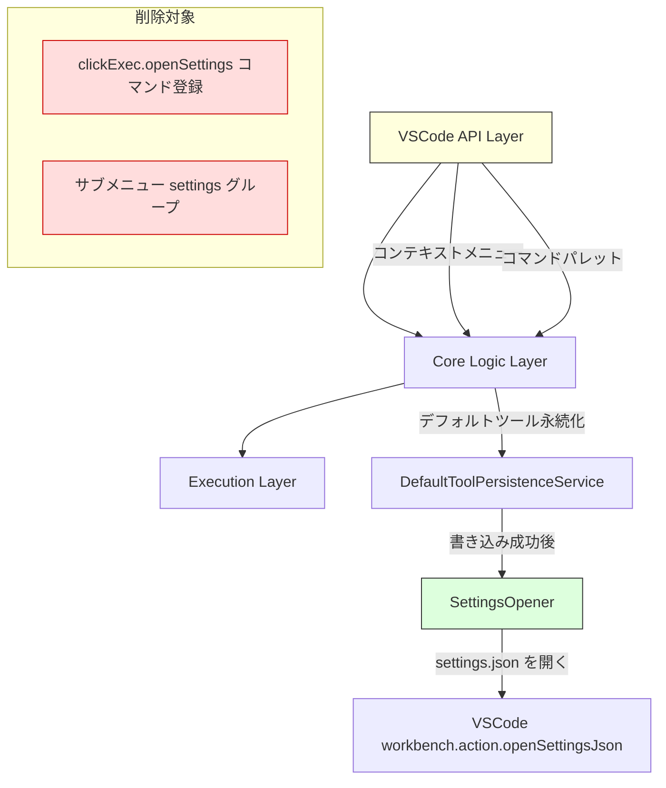

# 設計ドキュメント: 「設定を開く」メニュー項目の削除

## 概要

ClickExec拡張機能のコンテキストメニュー（「ClickExecで実行」サブメニュー）から「設定を開く...」メニュー項目を削除し、関連する `clickExec.openSettings` コマンドの登録を解除する。

サンプルコマンド自動追加機能（`DefaultToolPersistenceService`）の実装により、ユーザーが手動で設定を開く導線は不要となった。ただし、`SettingsOpener` モジュール（`openSettings()` 関数）は `DefaultToolPersistenceService` から引き続き使用されるため、モジュール自体は保持する。

主要な変更:
1. `package.json` から `clickExec.openSettings` コマンド定義とメニューエントリを削除
2. `extension.ts` から `clickExec.openSettings` コマンドの登録処理を削除
3. `settingsOpener.ts` モジュールは保持（`DefaultToolPersistenceService` が依存）
4. 既存スペックドキュメントを更新して整合性を維持

## アーキテクチャ

既存の3層アーキテクチャに変更はない。削除対象はVSCode API Layer内のコマンド登録とメニュー定義のみ。



### 変更の影響範囲

| ファイル | 変更内容 |
|---|---|
| `package.json` | `contributes.commands` から `clickExec.openSettings` を削除、`contributes.menus.clickExec.submenu` から settings グループのエントリを削除 |
| `src/extension.ts` | `clickExec.openSettings` コマンド登録処理と `openSettings` インポートを削除 |
| `src/settingsOpener.ts` | 変更なし（保持） |
| `src/defaultToolPersistenceService.ts` | 変更なし（`openSettings` の使用を維持） |

### 設計判断

1. **SettingsOpener モジュールの保持**: `DefaultToolPersistenceService` がコンストラクタで `openSettings` 関数を受け取り、サンプルコマンド書き込み成功後に呼び出している。この依存関係は維持する必要がある。
2. **コマンド登録のみ削除**: `openSettings()` 関数自体は内部APIとして残し、VSCodeコマンドとしての公開登録のみを削除する。これにより、既存の `DefaultToolPersistenceService` のテストやロジックに影響を与えない。
3. **既存スペックの更新**: 削除された機能に関する記述を既存スペックから更新し、ドキュメント間の整合性を保つ。

## コンポーネントとインターフェース

### 1. package.json（変更）

`contributes` セクションから以下を削除する:

**削除前:**
```json
{
  "commands": [
    { "command": "clickExec.runTool", "title": "ClickExec: ツールを実行" },
    { "command": "clickExec.selectAndRunTool", "title": "ClickExec: ツールを選択して実行" },
    { "command": "clickExec.openSettings", "title": "ClickExec: 設定を開く" }
  ],
  "menus": {
    "clickExec.submenu": [
      { "command": "clickExec.runTool", "group": "tools" },
      { "command": "clickExec.openSettings", "group": "settings" }
    ]
  }
}
```

**削除後:**
```json
{
  "commands": [
    { "command": "clickExec.runTool", "title": "ClickExec: ツールを実行" },
    { "command": "clickExec.selectAndRunTool", "title": "ClickExec: ツールを選択して実行" }
  ],
  "menus": {
    "clickExec.submenu": [
      { "command": "clickExec.runTool", "group": "tools" }
    ]
  }
}
```

変更点:
- `contributes.commands` から `clickExec.openSettings` エントリを削除
- `contributes.menus.clickExec.submenu` から `clickExec.openSettings` エントリを削除
- サブメニュー内は `tools` グループのみとなり、区切り線は表示されなくなる

### 2. extension.ts（変更）

以下を削除する:

```typescript
// 削除: openSettings のインポート
import { openSettings } from './settingsOpener';

// 削除: openSettings コマンドの登録
const openSettingsDisposable = vscode.commands.registerCommand(
  'clickExec.openSettings',
  () => openSettings()
);

// 削除: subscriptions への openSettingsDisposable の追加
```

`DefaultToolPersistenceService` のコンストラクタに渡す `openSettings` は、`defaultToolPersistenceService.ts` 内で直接インポートされているため、`extension.ts` からのインポート削除は影響しない。

**変更後の activate 関数:**
```typescript
export function activate(context: vscode.ExtensionContext): void {
  const configService = new ConfigurationService();
  const resolver = new PlaceholderResolver();
  const commandBuilder = new CommandBuilder(resolver);
  terminalManager = new TerminalManager();
  const persistenceService = new DefaultToolPersistenceService();

  currentTools = configService.loadTools();

  // clickExec.runTool コマンド（変更なし）
  const runToolDisposable = vscode.commands.registerCommand(
    'clickExec.runTool',
    async (uri: vscode.Uri) => { /* ... */ }
  );

  // clickExec.selectAndRunTool コマンド（変更なし）
  const selectAndRunToolDisposable = vscode.commands.registerCommand(
    'clickExec.selectAndRunTool',
    async () => { /* ... */ }
  );

  // 設定変更リスナー（変更なし）
  const configChangeDisposable = configService.onDidChangeTools((tools) => {
    currentTools = tools;
  });

  // openSettingsDisposable は削除
  context.subscriptions.push(
    runToolDisposable,
    selectAndRunToolDisposable,
    configChangeDisposable,
    { dispose: () => terminalManager.dispose() }
  );
}
```

### 3. settingsOpener.ts（変更なし）

モジュールは保持する。`DefaultToolPersistenceService` が `openSettings()` 関数を引き続き使用する。

```typescript
// 既存のまま保持
export async function openSettings(): Promise<void>;
```

### 4. defaultToolPersistenceService.ts（変更なし）

`openSettings` のインポートと使用は維持する。

```typescript
import { openSettings } from './settingsOpener';

export class DefaultToolPersistenceService {
  constructor(openSettingsFn: () => Promise<void> = openSettings) {
    this.openSettingsFn = openSettingsFn;
  }
  // resolveTools 内で this.openSettingsFn() を呼び出す（変更なし）
}
```

### 5. 既存スペックの更新

#### 5.1 open-settings-json スペック

- `requirements.md`: 要件1（コマンド登録）と要件2（コンテキストメニュー追加）に「削除済み」の注記を追加
- `design.md`: SettingsOpener セクションに「コマンド登録は削除済み、内部APIとしてのみ使用」の注記を追加。package.json の contributes 定義から `clickExec.openSettings` 関連を削除

#### 5.2 vscode-external-tools スペック

- `requirements.md`: 要件7（コマンド登録）と要件8（メニュー追加）に「削除済み」の注記を追加
- `design.md`: Extension Entry Point セクションから `clickExec.openSettings` コマンド登録を削除。package.json の contributes 定義を更新

## データモデル

データモデルへの変更はない。`ToolDefinition`、`PlaceholderContext`、`ExecutionCommand` 等の型定義は変更不要。

### package.json の contributes 変更差分（最終状態）

```json
{
  "contributes": {
    "commands": [
      { "command": "clickExec.runTool", "title": "ClickExec: ツールを実行" },
      { "command": "clickExec.selectAndRunTool", "title": "ClickExec: ツールを選択して実行" }
    ],
    "menus": {
      "explorer/context": [
        { "submenu": "clickExec.submenu", "group": "clickExec" }
      ],
      "editor/title/context": [
        { "submenu": "clickExec.submenu", "group": "clickExec" }
      ],
      "clickExec.submenu": [
        { "command": "clickExec.runTool", "group": "tools" }
      ]
    },
    "submenus": [
      { "id": "clickExec.submenu", "label": "ClickExecで実行" }
    ]
  }
}
```


## 正確性プロパティ

*プロパティとは、システムのすべての有効な実行において真であるべき特性や振る舞いのことである。人間が読める仕様と、機械で検証可能な正確性保証の橋渡しとなる。*

### プロパティ分析

この機能は主にコマンド登録とメニュー定義の削除であり、新しいロジックの追加はない。受け入れ基準の大半は以下に分類される:

- **静的検証（package.json の構造確認）**: 1.1, 1.2, 2.1 — 特定のファイルの内容を検証する例示テスト
- **UI動作の検証**: 1.3, 2.3 — ランタイムの統合テストが必要
- **コード構造の検証**: 2.2 — コードレビューの範疇
- **ドキュメント更新の検証**: 4.1〜4.4 — 自動テストには向かない
- **既存動作の保持**: 3.1〜3.3 — 既存テストでカバー済み

普遍的に量化可能なプロパティ（「任意の入力に対して…」）は存在しない。ただし、既存の `DefaultToolPersistenceService` の動作が変更後も保持されることは、既存のプロパティテスト（`defaultToolPersistenceService.property.test.ts`、`defaultToolProvider.property.test.ts`）で検証される。

### Property 1: package.json にコマンド定義が存在しないことの検証

*任意の* `package.json` の `contributes.commands` 配列内のコマンドに対して、そのコマンドIDが `clickExec.openSettings` と一致しないこと。また、`contributes.menus.clickExec.submenu` 配列内のエントリに対して、そのコマンドIDが `clickExec.openSettings` と一致しないこと。

**Validates: Requirements 1.1, 1.2, 2.1**

> 注: これは静的検証であり、ユニットテスト（例示テスト）として実装する。プロパティベーステストではない。

### Property 2: DefaultToolPersistenceService の openSettings 呼び出し保持

*任意の* OS プラットフォームに対して、`DefaultToolPersistenceService.resolveTools()` がユーザーの「はい」応答後に settings.json への書き込みに成功した場合、`openSettingsFn` が1回呼び出されること。

**Validates: Requirements 3.2, 3.3**

> 注: この検証は既存の `defaultToolPersistenceService.property.test.ts` でカバーされている。新規テストの追加は不要だが、既存テストが引き続きパスすることを確認する。

## エラーハンドリング

この機能変更ではエラーハンドリングの追加・変更はない。

既存のエラーハンドリングは変更なし:
- `DefaultToolPersistenceService` の settings.json 書き込み失敗時のフォールバック動作は維持
- `SettingsOpener` のエラーハンドリング（settings.json を開けない場合のエラーメッセージ）は維持

## テスト戦略

### テストフレームワーク

- **ユニットテスト**: Mocha + Chai
- **プロパティベーステスト**: fast-check（既存テストの実行確認のみ）

### テスト方針

この機能は削除・リファクタリングが主であるため、新規プロパティベーステストの追加は不要。以下の方針でテストする:

#### ユニットテスト（新規）

1. **package.json 構造検証テスト**
   - `contributes.commands` に `clickExec.openSettings` が含まれないことを検証
   - `contributes.menus.clickExec.submenu` に `clickExec.openSettings` が含まれないことを検証
   - タグ: `Feature: remove-open-settings-menu, Property 1: package.json にコマンド定義が存在しないことの検証`

2. **settingsOpener.ts モジュール存在確認テスト**
   - `settingsOpener.ts` ファイルが存在し、`openSettings` 関数がエクスポートされていることを検証
   - タグ: `Feature: remove-open-settings-menu, 要件 3.1: settingsOpener モジュールの保持`

#### 既存テストの実行確認（回帰テスト）

以下の既存プロパティテストが引き続きパスすることを確認する:

1. **defaultToolPersistenceService.property.test.ts** — DefaultToolPersistenceService の動作保持
   - タグ: `Feature: open-settings-json, Property 1: デフォルトツールの条件付き追加`
2. **defaultToolProvider.property.test.ts** — DefaultToolProvider の動作保持
   - タグ: `Feature: open-settings-json, Property 2: OSプラットフォームとデフォルトコマンドの正しい対応`

### テストファイル構成

```
src/test/
├── unit/
│   └── removeOpenSettingsMenu.test.ts  # 新規: package.json 構造検証 + モジュール存在確認
├── property/
│   ├── defaultToolPersistenceService.property.test.ts  # 既存: 回帰テスト
│   └── defaultToolProvider.property.test.ts            # 既存: 回帰テスト
```

### プロパティベーステストライブラリ

- **fast-check** を使用（既存プロジェクトで採用済み）
- 新規プロパティベーステストの追加は不要（削除機能のため普遍的プロパティが存在しない）
- 既存テストは最低100回のイテレーションで実行
- 各テストにはデザインドキュメントのプロパティ番号を参照するタグコメントを付与
- タグ形式: `Feature: {feature_name}, Property {number}: {property_text}`
