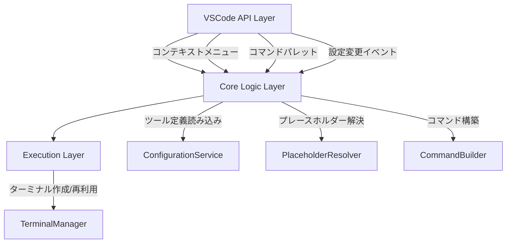

# 設計ドキュメント: ClickExec

## 概要

ClickExecは、VSCode拡張機能として、ユーザーが事前定義した外部コマンドをコンテキストメニューやコマンドパレットから実行する機能を提供する。Visual Studioの「外部ツール」機能に相当し、プレースホルダーによる動的なコマンド構成と、統合ターミナルでの実行をサポートする。

主要な機能フロー:
1. ユーザーが `settings.json` でツール定義を登録
2. エクスプローラー/エディタタブ/コマンドパレットからツールを選択
3. プレースホルダーを解決してコマンド文字列を構築
4. 統合ターミナルでコマンドを実行

## アーキテクチャ

拡張機能は以下の3層構造で設計する:



### レイヤー構成

- **VSCode API Layer**: `extension.ts` — コマンド登録、メニュー表示、イベントハンドリング
- **Core Logic Layer**: ツール定義の管理、プレースホルダー解決、コマンド構築
- **Execution Layer**: ターミナルの作成・再利用・コマンド送信

### 設計判断

1. **単一ファイル vs モジュール分割**: コア機能ごとにモジュールを分割する。テスタビリティと保守性を優先する。
2. **ターミナル再利用戦略**: ツール名をキーとしてターミナルを管理し、同名ターミナルが存在すれば再利用する。VSCodeのターミナルAPIの `dispose` イベントを監視して、閉じられたターミナルの参照を解放する。
3. **プレースホルダー解決の純粋関数化**: プレースホルダー解決ロジックをVSCode APIに依存しない純粋関数として実装し、単体テストを容易にする。

## コンポーネントとインターフェース

### 1. ConfigurationService

ツール定義の読み込みとバリデーションを担当する。

```typescript
interface ToolDefinition {
  name: string;
  command: string;
  cwd?: string;
}

class ConfigurationService {
  /** settings.json からツール定義を読み込み、バリデーション済みの配列を返す */
  loadTools(): ToolDefinition[];

  /** 設定変更を監視し、変更時にコールバックを呼び出す */
  onDidChangeTools(callback: (tools: ToolDefinition[]) => void): vscode.Disposable;
}
```

- `name` または `command` が未指定のツール定義はスキップし、警告を出力する
- 設定キー: `clickExec.tools`

### 2. PlaceholderResolver

コマンド文字列内のプレースホルダーを実際の値に置換する。

```typescript
interface PlaceholderContext {
  filePath?: string;       // 対象ファイルの絶対パス
  workspaceFolder?: string; // ワークスペースルートの絶対パス
}

class PlaceholderResolver {
  /**
   * コマンド文字列内のプレースホルダーを解決する。
   * 解決できないプレースホルダーがある場合はエラーをスローする。
   * 未知のプレースホルダーは空文字列に置換し、警告リストに追加する。
   */
  resolve(template: string, context: PlaceholderContext): ResolveResult;
}

interface ResolveResult {
  resolved: string;
  warnings: string[];  // 未知のプレースホルダーの警告
}
```

サポートするプレースホルダー:

| プレースホルダー | 解決元 |
|---|---|
| `${file}` | `context.filePath` |
| `${fileBasename}` | `path.basename(context.filePath)` |
| `${fileBasenameNoExtension}` | `path.basename(context.filePath, ext)` |
| `${fileExtname}` | `path.extname(context.filePath)` |
| `${dir}` | `path.dirname(context.filePath)` |
| `${workspaceFolder}` | `context.workspaceFolder` |

### 3. CommandBuilder

プレースホルダー解決済みのコマンドと作業ディレクトリを構築する。

```typescript
interface ExecutionCommand {
  command: string;
  cwd: string;
  toolName: string;
}

class CommandBuilder {
  constructor(private resolver: PlaceholderResolver);

  /**
   * ツール定義とコンテキストからExecutionCommandを構築する。
   * プレースホルダー解決に失敗した場合はエラーをスローする。
   */
  build(tool: ToolDefinition, context: PlaceholderContext): ExecutionCommand;
}
```

- `cwd` 未指定時は `${workspaceFolder}` をデフォルトとする
- `cwd` にもプレースホルダー解決を適用する

### 4. TerminalManager

ターミナルの作成・再利用・コマンド送信を管理する。

```typescript
class TerminalManager {
  /**
   * 指定された名前のターミナルを取得または作成し、コマンドを実行する。
   * 同名のターミナルが既に存在する場合は再利用する。
   */
  execute(command: ExecutionCommand): void;

  /** 管理中のターミナル参照をすべて解放する */
  dispose(): void;
}
```

- ターミナルは `Map<string, vscode.Terminal>` で管理
- `vscode.window.onDidCloseTerminal` で閉じられたターミナルをMapから削除

### 5. Extension Entry Point (`extension.ts`)

```typescript
export function activate(context: vscode.ExtensionContext): void;
export function deactivate(): void;
```

`activate` で以下を登録:
- コンテキストメニューコマンド: `clickExec.runTool`
- コマンドパレットコマンド: `clickExec.selectAndRunTool`
- 設定変更リスナー
- TerminalManagerのdispose登録

## データモデル

### ツール定義スキーマ（settings.json）

```json
{
  "clickExec.tools": [
    {
      "name": "Open in Explorer",
      "command": "explorer ${dir}",
      "cwd": "${workspaceFolder}"
    },
    {
      "name": "Run Python Script",
      "command": "python ${file}",
      "cwd": "${dir}"
    }
  ]
}
```

### package.json の contributes 定義

```json
{
  "contributes": {
    "configuration": {
      "title": "ClickExec",
      "properties": {
        "clickExec.tools": {
          "type": "array",
          "default": [],
          "description": "外部ツールの定義一覧",
          "items": {
            "type": "object",
            "required": ["name", "command"],
            "properties": {
              "name": {
                "type": "string",
                "description": "ツールの表示名"
              },
              "command": {
                "type": "string",
                "description": "実行するコマンド文字列（プレースホルダー使用可）"
              },
              "cwd": {
                "type": "string",
                "description": "作業ディレクトリ（プレースホルダー使用可、未指定時はワークスペースルート）"
              }
            }
          }
        }
      }
    },
    "commands": [
      {
        "command": "clickExec.runTool",
        "title": "ClickExec: ツールを実行"
      },
      {
        "command": "clickExec.selectAndRunTool",
        "title": "ClickExec: ツールを選択して実行"
      }
    ],
    "menus": {
      "explorer/context": [
        {
          "submenu": "clickExec.submenu",
          "group": "clickExec"
        }
      ],
      "editor/title/context": [
        {
          "submenu": "clickExec.submenu",
          "group": "clickExec"
        }
      ]
    },
    "submenus": [
      {
        "id": "clickExec.submenu",
        "label": "ClickExecで実行"
      }
    ]
  }
}
```

### PlaceholderContext の構築フロー

```mermaid
flowchart TD
    A[コンテキストメニュー] -->|URI| B{リソースタイプ判定}
    B -->|ファイル| C[filePath = URI.fsPath]
    B -->|フォルダ| D[filePath = URI.fsPath<br/>dir = URI.fsPath]
    
    E[コマンドパレット] --> F{アクティブエディタ?}
    F -->|あり| G[filePath = activeEditor.document.uri.fsPath]
    F -->|なし| H[filePath = undefined]
    
    C --> I[PlaceholderContext構築]
    D --> I
    G --> I
    H --> I
    I --> J[workspaceFolder = workspace.workspaceFolders?.[0]]
```


## 正確性プロパティ

*プロパティとは、システムのすべての有効な実行において真であるべき特性や振る舞いのことである。人間が読める仕様と、機械で検証可能な正確性保証の橋渡しとなる。*

### Property 1: ツール定義のバリデーション — 有効な定義のみが返される

*任意の*オブジェクト配列に対して、`name`（非空文字列）と`command`（非空文字列）の両方を持つオブジェクトのみが有効なToolDefinitionとして返され、それ以外はフィルタリングされること。また、フィルタリングされた数だけ警告が生成されること。

**Validates: Requirements 1.2, 1.3**

### Property 2: 既知プレースホルダーの正しい解決

*任意の*ファイルパス（絶対パス）とワークスペースフォルダパスに対して、各既知プレースホルダー（`${file}`, `${fileBasename}`, `${fileBasenameNoExtension}`, `${fileExtname}`, `${dir}`, `${workspaceFolder}`）が対応するパス操作の結果と一致する値に解決されること。また、解決後の文字列に既知プレースホルダーのパターンが残っていないこと。

**Validates: Requirements 2.1, 2.2**

### Property 3: 未知プレースホルダーの空文字列置換

*任意の*未知プレースホルダー名（既知の6種以外の `${...}` パターン）を含むコマンド文字列に対して、解決後にそのプレースホルダーが空文字列に置換され、警告リストにそのプレースホルダー名が含まれること。

**Validates: Requirements 2.3**

### Property 4: フォルダコンテキストでのプレースホルダー解決

*任意の*フォルダパスに対して、フォルダをコンテキストとしてプレースホルダーを解決した場合、`${file}` と `${dir}` の両方がそのフォルダの絶対パスに解決されること。

**Validates: Requirements 3.6**

### Property 5: cwdのプレースホルダー解決とデフォルト値

*任意の*ToolDefinitionとPlaceholderContextに対して、`cwd`が指定されている場合はそのcwd文字列にプレースホルダー解決が適用された値が作業ディレクトリとなり、`cwd`が未指定の場合は`${workspaceFolder}`の解決値が作業ディレクトリとなること。

**Validates: Requirements 6.4, 6.5**

### Property 6: プレースホルダー解決のべき等性

*任意の*コマンド文字列とPlaceholderContextに対して、プレースホルダー解決を1回適用した結果と2回適用した結果が同一であること（解決済み文字列に新たなプレースホルダーパターンが生じないこと）。

**Validates: Requirements 2.2**

## エラーハンドリング

### エラー分類と対応

| エラー状況 | 対応 | ユーザーへの通知 |
|---|---|---|
| ツール定義に必須フィールドが欠落 | 該当定義をスキップ | `vscode.window.showWarningMessage` |
| 未知のプレースホルダー | 空文字列に置換して続行 | `vscode.window.showWarningMessage` |
| プレースホルダー値が解決不能 | コマンド実行を中止 | `vscode.window.showErrorMessage` |
| ターミナル作成失敗 | コマンド実行を中止 | `vscode.window.showErrorMessage` |
| ツール定義が0件 | メニューに案内メッセージ表示 | コンテキストメニュー内テキスト |

### エラーメッセージ例

- 警告: `"ClickExec: ツール定義 'xxx' は name または command が未指定のためスキップされました"`
- 警告: `"ClickExec: 未知のプレースホルダー '${xxx}' は空文字列に置換されました"`
- エラー: `"ClickExec: ワークスペースが開かれていないため ${workspaceFolder} を解決できません"`
- エラー: `"ClickExec: ターミナルの作成に失敗しました"`

## テスト戦略

### テストフレームワーク

- **ユニットテスト**: Mocha + Chai（VSCode拡張機能の標準）
- **プロパティベーステスト**: [fast-check](https://github.com/dubzzz/fast-check)
- **統合テスト**: `@vscode/test-electron` による実環境テスト

### テスト対象の分類

#### プロパティベーステスト（fast-check）

純粋関数として実装されるコアロジックに対して、各正確性プロパティを実装する:

1. **ConfigurationService.loadTools のバリデーション** — Property 1
   - ランダムなオブジェクト配列を生成し、有効な定義のみが返されることを検証
   - タグ: `Feature: vscode-external-tools, Property 1: ツール定義のバリデーション`

2. **PlaceholderResolver.resolve の正しい解決** — Property 2
   - ランダムなファイルパスとワークスペースパスを生成し、各プレースホルダーの解決結果を検証
   - タグ: `Feature: vscode-external-tools, Property 2: 既知プレースホルダーの正しい解決`

3. **PlaceholderResolver.resolve の未知プレースホルダー処理** — Property 3
   - ランダムな未知プレースホルダー名を生成し、空文字列置換と警告生成を検証
   - タグ: `Feature: vscode-external-tools, Property 3: 未知プレースホルダーの空文字列置換`

4. **PlaceholderResolver.resolve のフォルダコンテキスト** — Property 4
   - ランダムなフォルダパスを生成し、${file}と${dir}の解決結果を検証
   - タグ: `Feature: vscode-external-tools, Property 4: フォルダコンテキストでのプレースホルダー解決`

5. **CommandBuilder.build のcwd解決** — Property 5
   - ランダムなToolDefinitionとコンテキストを生成し、cwdの解決結果を検証
   - タグ: `Feature: vscode-external-tools, Property 5: cwdのプレースホルダー解決とデフォルト値`

6. **PlaceholderResolver.resolve のべき等性** — Property 6
   - ランダムなコマンド文字列を生成し、1回と2回の解決結果が同一であることを検証
   - タグ: `Feature: vscode-external-tools, Property 6: プレースホルダー解決のべき等性`

各プロパティテストは最低100回のイテレーションで実行する。

#### ユニットテスト（Mocha + Chai）

- **TerminalManager**: ターミナル名の設定、同名ターミナルの再利用（Requirements 4.2, 4.3）
- **エッジケース**: 
  - ワークスペース未開放時の `${workspaceFolder}` エラー（Requirements 2.4）
  - アクティブエディタなし時のファイル固有プレースホルダー空文字列解決（Requirements 5.4）
  - ターミナル作成失敗時のエラーハンドリング（Requirements 4.4）
- **統合テスト**: コンテキストメニュー表示、コマンドパレット連携（Requirements 3.1-3.5, 5.1-5.3）

### テストファイル構成

```
src/test/
├── unit/
│   ├── configurationService.test.ts
│   ├── placeholderResolver.test.ts
│   ├── commandBuilder.test.ts
│   └── terminalManager.test.ts
├── property/
│   ├── configurationService.property.test.ts
│   ├── placeholderResolver.property.test.ts
│   └── commandBuilder.property.test.ts
└── integration/
    └── extension.test.ts
```
